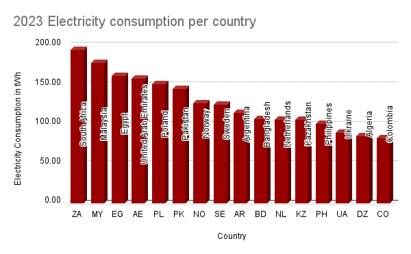
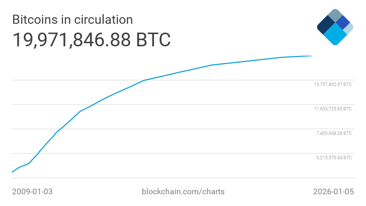
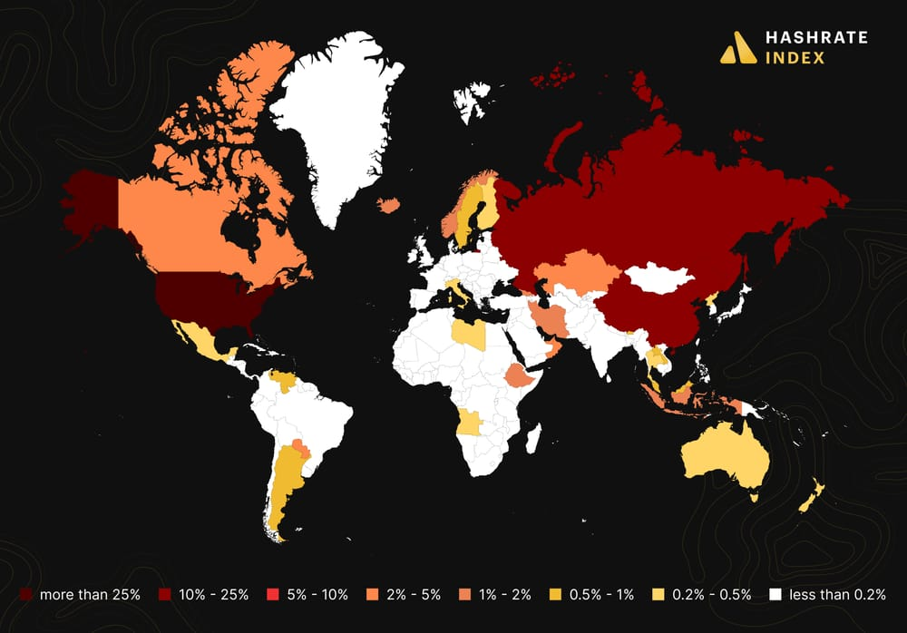
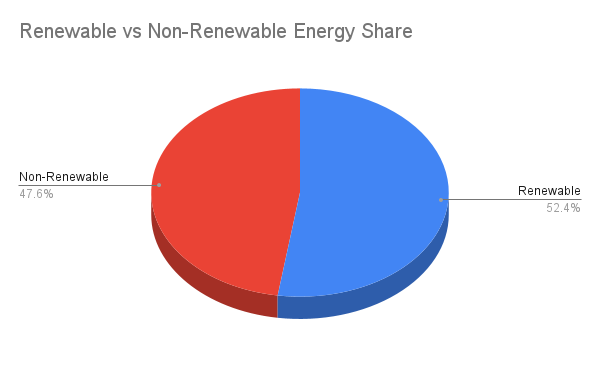
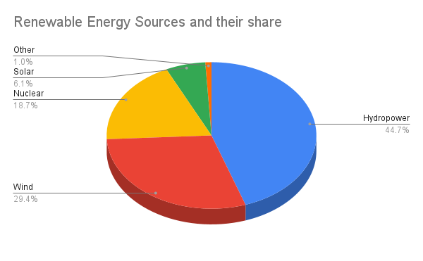
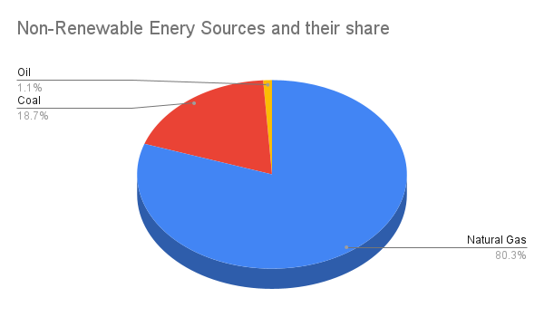
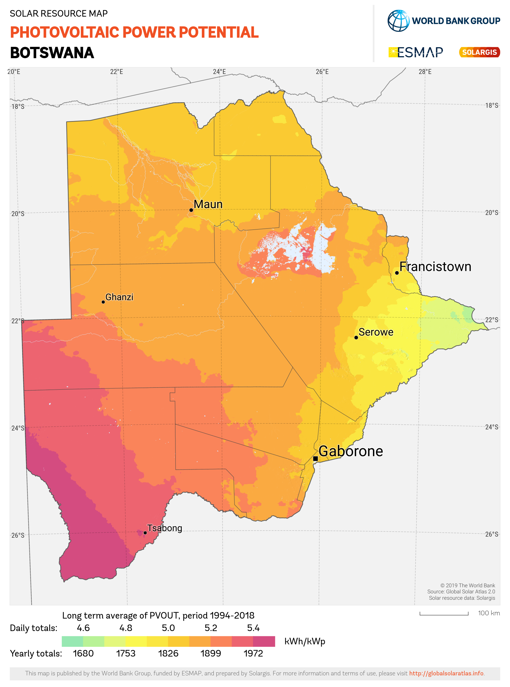
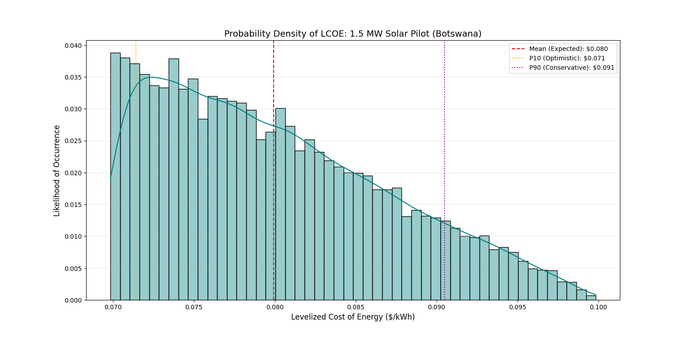
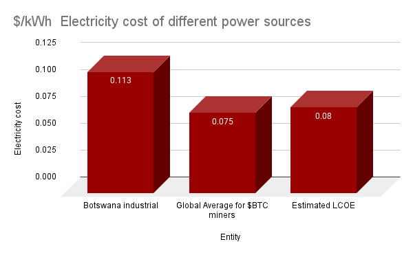

#  Rehoboth Research LLC

## Whitepaper: Bitcoin Mining & The Solar Opportunity
**Authored by Besa Masaiti: besa@rehobothresearch.org**

## Structure
- Executive summary
- Introduction: The Bitcoin Mining Landscape
- The Energy Challenge in Bitcoin Mining
- Solar as a Strategic Solution
- Integration: Solar-powered mining and AI Data Centers
- Risks
- Roadmap
- Contact Rehoboth Research
- Sources Cited

---

## Executive Summary

Seventeen years after Satoshi Nakamoto published the Bitcoin whitepaper, Bitcoin has evolved from a peer-to-peer electronic cash system into a globally distributed settlement network secured by proof-of-work computation. Public discourse around Bitcoin focuses on price volatility, speculation and often comparisons to gold and the S&P500, which have market caps of: **$1.8T**, **$31T** and **$58T** respectively (as of 2025). However, there is a more pertinent factor that needs addressing, and that is energy. 

Bitcoin is valuable not because of speculation but because it is backed by a real-world annual **630 billion MJ of high energy demand** required to secure the Bitcoin network. However, the same energy intensity that secures the network has become the primary constraint on mining profitability, regulatory acceptance, and long-term sustainability. Per the Cambridge Bitcoin Electricity Consumption Index, Bitcoin mining currently consumes an estimated **195.9 tWh**(Cambridge Bitcoin Electricity Consumption Index) of electricity annually(2025 range was 120-200 tWh)-more than nordic countries like Norway(**124 tWh**)(World Population Review, 2026) as measured by the World Population Review’s Electricity Consumption per country's 2023 data set. 

*Electricity Consumption per Country, 2023.*
Source: [World Population Review (2023)](https://worldpopulationreview.com/country-rankings/electricity-consumption-by-country). *Vizualization modified by author*

The process, which relies on fossil fuels like coal for ~48% of global activity- emits an approximate 39M metric tones(Cambridge Digital Mining Industry Report, 2025) -98M metric tones(Swissinfo, 2025) of carbon dioxide annually, a greenhouse gas attributed to global warming. Furthermore, electricity-backed by energy, as an operational expense for bitcoin miners accounts for 60-80% of operational expenses(Solartechonline, 2025). 

This whitepaper argues that the future competitiveness of Bitcoin mining depends on a structural shift toward low-cost, off-grid renewable energy sources in high-irradiance regions. Specifically, it evaluates solar energy deployment in Botswana as a strategic opportunity for Bitcoin miners seeking to reduce operating costs, mitigate regulatory risk, and improve long-term economic resilience.

This paper: 
- Quantifies Bitcoin mining’s energy requirements and cost structure
- Evaluates the economic case for solar-powered, off-grid mining
- Models a Botswana-based solar microgrid achieving **~$0.08/kWh LCOE**
- Evaluates mining profitability under energy & Bitcoin price volatility
- Proposes a scalable roadmap for solar-powered compute infrastructure 

## Introduction: The Bitcoin Mining Landscape

Bitcoin mining is the computational process that secures the bitcoin network and introduces new $BTC into circulation. It relies on a proof-of-work consensus mechanism in which miners compete to solve difficult **SHA-256** based cryptography puzzles. The reward for solving each puzzle is currently **~3.125 $BTC** plus some transaction fees.  

### Block reward formula
$$
Reward_t = \frac{50}{2^{\left\lfloor \frac{\text{Current Block}}{210000} \right\rfloor}}
$$

Bitcoin’s issuance follows a fixed, anti-inflationary tokenomics model with a maximum supply of **21M bitcoins**. Approximately **19.8M bitcoins** (Blockchain.com)are in circulating supply and it is estimated that bitcoin mining will cease by the year 2140 with rewards for miners decreasing over time.

*All-time total $BTC circulating supply.*
Source: [Blockchain.com](https://www.blockchain.com/explorer/charts/total-bitcoins). 

This is because Bitcoin supply is governed by halving economics. This means, the reward for bitcoin mining decreases by half every **210K blocks**- approximately every 4 years (Investopedia, 2025). As a result, miners depend on higher ASIC efficiencies plus reduced electricity costs to keep their profit margins, making energy costs a central determinant of profitability. 

The hardware used to mine bitcoin can range from: application specific integrated circuits(ASICs,specialized hardware optimized for SHA-256 hashing) to CPUs and GPUs. ASICs are the most widely used due to their higher efficiency and higher hash rate output. Hash rate in this context, refers to the rate at which an ASIC or bitcoin mining tool can solve the aforementioned cryptography problems-whose difficulty increases with time.

### Mining Difficulty 
$$
Difficulty_t = Difficulty_{t-1} \times \frac{\text{Time for 2016 Blocks}}{2\ \text{Weeks}}
$$

Hash rate is a key performance indicator in determining profitability for Bitcoin miners and is measured in H/s(Hashes per second). Typical ASIC efficiency is also measured in Joules per Terahash(J/TH) (Tlhalerwa & Mulalu, 2019).

While ASIC efficiency continues to improve, mining hardware requires significant energy input and contributes to global e-waste as older machines become obsolete(Tlhalerwa & Mulalu, 2019). Notably, companies like Mara Holdings have done much to ensure any excess energy from bitcoin mining can be rerouted to heat homes, as seen with their pilot project-heating around **11K** homes in Finland. 

Miners face increasing regulatory pressure related to sustainability, grid impact & congestion and emissions. As block rewards decline and competition for hash rate intensifies, the industry is shifting toward low-cost, stable and scalable renewable energy sources as a strategic necessity alongside an eventual reliance on transaction fees. 

## The Energy Challenge in Bitcoin Mining

Mining bitcoin carries a range of operational expenses. These include: 
- ASICs procurement and depreciation
- Cooling infrastructure and thermal management
- Labor and maintenance costs
- Housing and land costs
- Electricity costs which make up **60-80%** of OPEX depending on the miner.

Electricity costs measured in $/kWh, range significantly by geo-location.Before 2022, most bitcoin mining operations were carried out in China(60% of the hash rate) (Bitbo.io)due to cheap coal-based electricity backed by high government subsidies as well as a Hydro-electric power mix. However, following regulatory crackdowns on energy-intensive activities and concerns over grid stability and emissions, bitcoin mining was outlawed. Today, miners operate in different countries like: Iran, Kazakhstan, some parts of China and Russia, some U.S.A states, parts of Africa and Latin America(hashrateindex.com, 2025).

*Global Hashrate Distribution(2025).*
Source: [hashrateindex.com](https://hashrateindex.com/blog/top-10-bitcoin-mining-countries-of-2025/). 

Energy is cheapest in regions like Iran and Kazakhstan which are coal-based and in some states like Texas and Kansas which offer incentives to bitcoin miners who relocate to them. Western countries like Ireland offer higher tariffs(electricity costs) for miners due to a higher residential usage/ demand for electricity(solartechonline, 2025) (Bashari et al., 2025). 

A Cambridge Digital mining report also stated that miners’ electricity mix is predominantly sustainable **(52.4%)**, with renewables accounting for **42.6%**. Hydropower constitutes the largest sustainable source **(23.4%)**, followed by wind **(15.4%)**, nuclear **(9.8%)**, solar **(3.2%)**, and other renewables **(0.5%)**. Fossil fuels make up **47.6%**, primarily natural gas **(38.2%)**, which is also the single largest energy source, followed by coal **(8.9%)** and oil **(0.5%)**(Cambridge Digital Mining Industry Report, 2025). 

*Renewable vs Non-Renewable Energy Share(April 2025).*
Source: [Cambridge Digital Mining Industry Report](https://www.jbs.cam.ac.uk/wp-content/uploads/2025/04/2025-04-cambridge-digital-mining-industry-report.pdf). *Vizualization modified by author*

*Renewable Energy Share(April 2025).*
Source: [Cambridge Digital Mining Industry Report](https://www.jbs.cam.ac.uk/wp-content/uploads/2025/04/2025-04-cambridge-digital-mining-industry-report.pdf). *Vizualization modified by author*

*Non-Renewable Energy Share(April 2025).*
Source: [Cambridge Digital Mining Industry Report](https://www.jbs.cam.ac.uk/wp-content/uploads/2025/04/2025-04-cambridge-digital-mining-industry-report.pdf). *Vizualization modified by author*

Grid-connected mining operations face several structural risks:
- Public and Environmental Scrutiny: High energy use often leads to media attention and negative public perception, which can influence regulatory action and hinder business expansion plans. This can be seen with President Trump's recent announcement on Truth Social to ensure data centers ‘pay their fair share’ of electricity costs due to grid-connected participation(X.com, 2025).
- Regulatory exposure: In the US, the U.S Energy Information Administration recently moved to initiate a provisional survey of electricity consumption for U.S cryptocurrency mining companies, which was paused after a series of those companies sued it (earthjustice.org, 2024). 
- Forced shutoffs during high-demand periods: Grid-connected operations often have to shut down operations during high demand periods, to allow for energy use by more critical infrastructure and stabilize prices which has an effect on expected profitability(finance.yahoo.com, 2026). 

*Off-grid mining, by contrast, offers energy sovereignty. Miners that generate their own electricity avoid grid congestion, price spikes, and curtailment mandates, while gaining greater control over operating costs and regulatory exposure.*

As block rewards decline and competition intensifies, energy economics not hardware alone-becomes the primary determinant of mining viability.
Solar energy, particularly in regions with exceptional irradiance such as Botswana presents a strategic opportunity to address energy demands and mandates for sustainable energy use.

## Botswana’s Solar as a strategic solution

*Botswana Photovoltaic potential.*
Source: [Solar resource map © 2021 Solargis](https://solargis.com/resources/free-maps-and-gis-data?locality=botswana). 

Botswana is a landlocked, Southern African country with approximately 2.5M people, lying on **581,730 $km^2$** of land. It boasts about **3200 hours** of annual sunlight and a direct normal irradiance(**DNI**) of about **1900+kWh/$m^2$/year**. DNI measures the amount of solar radiation hitting a surface per area, that is perpendicular to the sun’s rays. An alternative measure is **GHI**, which measures the total solar radiation hitting a horizontal surface- Botswana’s is around **21MJ/$m^2$** with peaks of up to **45MJ/$m^2$** annually. (gov.bw) (Tlhalerwa & Mulalu, 2019)

## Botswana Energy landscape
As of 2025, Botswana’s energy system remains overwhelmingly fossil-fuel dependent. Approximately **98.8% of electricity generation is non-renewable**, with coal accounting for nearly all domestic power production at an estimated **2.58 billion kWh per year**. Grid-scale renewable electricity contributes **less than 1% of total generation**, with solar representing approximately **3.2% of the renewable energy mix**, indicating substantial untapped potential rather than existing capacity (Our World in Data).

Despite domestic coal production, Botswana remains partially energy import-dependent. Roughly **49% of primary energy supply is imported**, primarily in the form of oil products and supplemental coal, resulting in an estimated **61% energy self-sufficiency ratio**. This exposure to imports introduces price volatility and energy security risks.

Traditional biomass remains a significant component of total final energy consumption (TFEC), accounting for approximately **27%**, largely for residential cooking. Over **66% of households** rely on biomass fuels, underscoring both energy access challenges and the government’s stated intention to phase out traditional biomass use in favor of modern energy sources.

Under **Vision 2036**, Botswana has committed to increasing renewable energy’s share of electricity generation to **50% by 2036**, up from an estimated **~7% policy target baseline in 2025**. Achieving this transition will require rapid deployment of utility-scale solar infrastructure, independent power producers (IPPs), and off-grid solutions.
 
|Source|Share (%)|Production (bn kWh/year)|Notes|
|------|---------|------------------------|-----|
|Fossil Fuels (Coal)|98.8|2.58|Domestic dominant; 59% self-sufficiency|
|Renewables (Solar/Wind/Hydro)|<1|~0.005|Solar 3.2% of RE; potential untapped|
|Biomass (Traditional)|27(TFEC)|---|Cooking 66.6% households; phase-out target|

### Existing and Planned Solar Sites: 
**Operational / Under Construction**
- **Mmadinare Solar Complex (120 MW)** – Scatec; Phase 1 operational 2025 with 60 MW Phase 2 expansion underway.
- **Shumba Tati Solar (100 MW)** – Under construction; expected operational in 2026.

**Planned / Announced Projects**
- **Jwaneng Solar Project (100 MW)** – Planned deployment in 2025.
- **IPP Pipeline (335 MW)** – Multiple independent power producer projects scheduled between 2025–2027.

**MoUs and Large-Scale Announcements**
- **Oman-led Renewable Project (3 GW)** – Solar, wind, and battery energy storage system (BESS) agreement announced in 2025.
- **KP Group Investment MoU ($4B, 5 GW)** – Utility-scale solar capacity under memorandum of understanding, subject to execution and financing.

__Solar energy generation consists of two main approaches: Concentrated solar power(CSP) and photovoltaic systems. Our focus will be on the latter, due to its wide usage in utility scale solar projects- most relevant for bitcoin miners.__

## Photovoltaic Systems in Solar Energy

A photovoltaic systems broadly, involve the usage of silicon based panels made up of cells that trap photons from solar radiation which offset electrons in the silicon cells creating a direct current( DC) which is then converted into alternating current(AC)  using inverters and then transported via cables to transmitters which transport the electricity to target areas like: residentials, commercials, utility scale project etc. 

$$
Sunlight ->DC(panels)->AC(inverters)-> Homes, businesses, utility scale facilities
$$

There are three well known types of photovoltaic systems: 
- Monocrystalline: Silicone solar cells manufactured using the Czochralski method from single silicone crystals.
- Polycrystalline: Silicone solar cells manufactured using multiple silicone crystals.
- And Thin film: Made from photovoltaic material deposited onto a backing plate made of substrate like glass, aluminium etc.(solarreviews.com, 2025)

|Type| Efficiency| Cost in **$/Watt**|
|----|-----------|-------------------|
|Monocrystalline|17-22%|$1-$1.5|
|Polycrystalline|15-17%|$0.9-$1|
|Thin film|10-13%|$0.5-$1|

### Levelized cost of energy (LCOE) Financial Modelling Methodology

To quantify the economic incentive for bitcoin miners to pivot to using Botswana based solar energy, we modelled a levelized cost of energy(**LCOE**) for a 1.5 MW solar microgrid pilot project.
Key Assumptions:
- Capacity factor: ~20%
- Discount rate: 8%
- Project lifespan: 20
- CAPEX + OPEX: ~$1.3M(base case with **$200K** reserved for battery storage)
- Panel degradation: A degradation annual rate of 0.5% for the solar panels, which does impact solar output
- Socio-political and regulatory climate: Stable economic and political conditions and friendly environment for renewable energy independent power producers

### LCOE formula 

$$ LCOE = \frac{\sum_{t=1}^{n} (CAPEX_t + OPEX_t )}{\sum_{t=1}^{n} Energy\ Output_t} $$

Our base-case model estimates a **$0.08/kWh LCOE**. To account for capital cost uncertainty, a Monte Carlo simulation was conducted with CAPEX treated as a stochastic variable. Simulated outcomes produce a **10th–90th percentile** LCOE range of approximately **$0.071–$0.091/kWh**, with a mean near **$0.08**.

*Simulated LCOE probability distribution for solar generation.*  
Source: [ourworldindata](https://ourworldindata.org/grapher/solar-pv-prices), [seef.co.bw](https://www.seeff.co.bw/results/vacant-land/?advanced_search=a0660ee01fe52a19f5723763268231c6&main_type=commercial), [sinovoltaics.com](https://sinovoltaics.com/learning-center/consumers/labor-costs-installing-solar-panels/), [fnbbotswana.co.bw](https://www.fnbbotswana.co.bw/for-my-business/value-adds/index.html#:~:text=Comprehensive%20cover%20for%20the%20unexpected&text=The%20cover%20ranges%20from%20P120,policy%20documents%20are%20issued%20immediately.), [taxsummaries.pwc.com](https://taxsummaries.pwc.com/botswana/corporate/taxes-on-corporate-income). *Author calculations & vizualization*

__The model assumes a flexible mining load that dynamically scales with solar generation, minimizing the need for costly battery storage. This design prioritizes capital efficiency over continuous uptime and is appropriate for pilot-scale deployments.__

*$/kWh cost differences.*  
Source: [pvknowhow.com](https://www.pvknowhow.com/solar-report/botswana/), [pvknowhow.com](https://www.pvknowhow.com/solar-report/botswana/) *Author calculations and visualization* *Note: Note: Global Bitcoin mining electricity costs vary widely by region and energy source, typically ranging from approximately $0.05–$0.08/kWh. The value shown represents an indicative midpoint used for comparative purposes.*

### Noteable benchmarks 
It is also worth mentioning, benchmarkable case studies of African countries where renewable energy  pilots have been constructed to power bitcoin miners. These include:
- Kenya: In March 2024, Marathon Digital announced a signed deal with Kenya, wherein MARA will be capitalizing on Kenya’s underutilized Geothermal energy resources to power their operations. (nasdaq.con, 2024)
- Ethiopia: UAE-based Phoenix Group, signed a 80MW power purchase agreement with EEP(Ethiopian Electric Power) leveraging primarily hydropower energy, announced January 2025(phoenixgroupuae.com, 2025). Though in Q3 2025, EEP announced plans to phase out $BTC miners due to the strain on the electric grid that they pose(coingeek.com, 2025). 

Recent academic literature on cryptocurrency mining and carbon emissions argues that mining should be incentivized in regions ranked higher in the Environment Performance Index, which takes into account: energy price, energy generation, sources, temperature, legal constraints, human capital, R &D (Bashari et al., 2025). However, the literature primarily focuses on markets with mature energy infrastructure, overlooking high-irradiance regions where renewable energy generation potential is substantial but underdeveloped due to limited capital or generation capacity.

__Botswana offers high solar output, stable peace and economic conditions and an opening for (foreign direct investment) FDI, especially Bitcoin miners seeking ways to drive down OPEX due to electricity in order to remain profitable.__

## Integration: Solar + Bitcoin + AI

In the last 2-3 years, large-scale Bitcoin mining operators have pivoted to maximizing usage of their facilities by integrating both bitcoin mining and AI data hosting. This is in part due to shared economic and operational characteristics:
- High Computational intensive nature
- Mutual need for efficient cooling systems/ hardware
- Dependence on low-cost electricity 

Leveraging their facilities for their already set: cooling systems, access to energy via independent production/ signed PPAs to serve both bitcoin mining and AI services has proven not only strategic but economically positive for bitcoin miners. An estimate shows converting existing sites for AI hosting can earn miners **$1-4M per MW annually**(aterio.io, 2025). 

By colocating Bitcoin mining and AI workloads around a shared renewable energy source, operators can significantly improve asset utilization and revenue stability. This is a version of colocation that this paper presents- referring not just to shared cooling or physical infrastructure, but to the strategic co-siting of multiple compute workloads around a common renewable energy source.

### Load Stacking
Despite their technological similarities, bitcoin mining and AI infra differ in how they absorb or use energy from the grid. In our assumed off-grid solar microgrid model:
1. Solar produces excess power midday with flexible loads that ‘turn off’ during none daylight hours with some energy storage
2. Bitcoin mining acts as a flexible, interruptible load
3. AI workloads (training, inference, data labeling) can be scheduled during predictable generation windows

$$
Solar generation -> AI priority load -> Bitcoin mining (spillover/ flexible)
$$

Under this model:
- Solar energy first serves priority AI workloads
- Excess generation is absorbed by Bitcoin mining
- Mining curtails automatically when generation declines

This ***load stacking*** approach transforms intermittency from a liability into a feature. Bitcoin mining monetizes surplus energy that would otherwise be curtailed, while AI workloads generate higher-margin revenue during periods of reliable supply.

### Economic Implications
Colocated compute infrastructure:
- Increases revenue per MW of installed capacity
- Improves project IRR
- Reduces exposure to Bitcoin price volatility
- Preserves upside optionality during bull markets

This strategy reframes Bitcoin mining not as a standalone activity, but as a flexible energy-balancing layer within renewable-powered compute campuses.

## Risks
**1. Technical Risks**

|Risk| Mitigation|
|----|-----------|
|Solar intermittency|Flexible load|
|Equipment Degradation| Conservative capacity factor|
|Cooling in high-temperature environments| Modular scaling|

**2. Economic Risks**

|Risk| Mitigation|
|----|-----------|
|BTC price volatility|Monte Carlo modelling|
|ASIC obsolescence |Short hardware depreciation assumptions|
|CAPEX inflation |Optional dual-use compute|

**3. Regulatory & Policy Risks**

|Risks| Mitigation|
|-----|-----------|
|Energy Policy changes|Botswana’s stable regime|
|Mining restrictions| Off-grid set-up reduces grid exposure|
|Import duties/ licensing relays| Pilot-scale footprint|

**4. Execution Risks**

Risks|Mitigation|
|----|----------|
|Solar site feasibility risk|Rehoboth Research proprietary AI/ML feasibility MVP that classifies solar-viable sites across Botswana using irradiance, land-use, and terrain data, reducing early-stage CAPEX misallocation|
|Supply Chain delays|EPC partnerships|
|Skilled labor shortages|Phased deployment|
|Project overruns|Conservative timelines|

## Roadmap & Timelines
The following roadmap outlines **Rehoboth Research's** phased approach to developing and scaling solar-powered compute infrastructure in Botswana. Progression between phases is conditional on achieving predefined technical, economic, and operational benchmarks.

**Phase 0 Pre-pilot (3–6m)**  
`[■■■■■■]` Launch Solar feasibility MVP

**Phase 1 Pilot (0–12m)**  
`[■■■■■■■■■■■■]` 1–2 MW solar pilot· flexible mining load · data collection · regulatory alignment

**Phase 2 Optimization(12–36m)**  
`[■■■■■■■■■■■■■■■■■■■■■■]` Scale to 5–10 MW · Optional storage · Hybrid AI workloads

**Phase 3 Replication(36m+)**  
`[■■■■■■■■■■■■■■■■■■■■■■]` Regional expansion · Infra fund model

**Key Metrics by Phase**
- Phase 1: LCOE achieved, Uptime , Hashrate per $ CAPEX  
- Phase 2: Cost per MW subsidized, Revenue stability, Load efficiency  
- Phase 3: IRR, Payback period, Portfolio diversification  

## Contact 
Rehoboth Research LLC is a Pennsylvania-based independent research firm focused on the convergence of renewable energy, high-performance compute, and decentralized finance. We provide data-driven feasibility studies and strategic roadmaps for infrastructure investors and technology operators in the SADC region

**Founder & Whitepaper Author:**  
Besa Masaiti 

Email: besa@rehobothresearch.org

X (Twitter): https://x.com/BesaMasaiti 

LinkedIn: https://www.linkedin.com/in/besa-masaiti/

For research collaboration, infrastructure partnerships, or investment-related inquiries:

📧 Email: info@rehobothresearch.com   
🔗 LinkedIn: linkedin.com/company/rehoboth-research

**Legal Disclaimer**:
*This white paper is for informational and research purposes only and does not constitute financial, investment, or legal advice. The calculations, including Levelized Cost of Energy (LCOE) and Internal Rate of Return (IRR) estimates, are based on current market data and stochastic modeling which are subject to change. Cryptocurrency mining involves significant risks, including asset volatility and regulatory shifts. Rehoboth Research LLC shall not be held liable for any financial losses or decisions made based on the contents of this document.*

## Sources Cited
### Bitcoin Network, Mining & Energy Consumption 

Investopedia. (2025). *Understanding Bitcoin Halving: Impact on Price and Investment Strategies*. https://www.investopedia.com/bitcoin-halving-4843769#:~:text=Key%20Takeaways,guard%20against%20fiat%20currency%20inflation

Cambridge Centre for Alternative Finance (CCAF). Cambridge Bitcoin Electricity Consumption Index (CBECI).
https://ccaf.io/cbnsi/cbeci

Cambridge Centre for Alternative Finance. Cambridge Digital Mining Industry Report.
https://www.jbs.cam.ac.uk/faculty-research/centres/alternative-finance/publications/cambridge-digital-mining-industry-report/

https://www.jbs.cam.ac.uk/wp-content/uploads/2025/04/2025-04-cambridge-digital-mining-industry-report.pdf

Swissinfo.ch. Bitcoin causes up to 98 million tonnes of CO₂ per year.
https://www.swissinfo.ch/eng/various/bitcoin-causes-98-million-tonnes-of-co2-per-year/89439335

Blockchain.com. Total Bitcoins in Circulation.
https://www.blockchain.com/explorer/charts/total-bitcoins

Bitbo. Bitcoin Mining by Country.
https://bitbo.io/tools/mining-by-country/

Hashrate Index. Top 10 Bitcoin Mining Countries of 2025.
https://hashrateindex.com/blog/top-10-bitcoin-mining-countries-of-2025/

### Electricity Consumption & Global Energy Context

World Population Review. Electricity Consumption by Country (2023).
https://worldpopulationreview.com/country-rankings/electricity-consumption-by-country

Earthjustice. Cryptocurrency miners and electricity reporting requirements.
https://earthjustice.org/experts/mandy-deroche/cryptocurrency-miners-need-to-report-their-energy-use

Yahoo Finance. Bitcoin mining and grid stabilization.
https://finance.yahoo.com/news/bitcoin-mining-actually-stabilizes-grids-100216656.html

### Solar Energy & Botswana-Specific Data

Government of Botswana. Renewable Energy Sources Overview.
https://www.gov.bw/natural-resources/renewable-energy-sources

Solargis. Solar Resource Maps and GIS Data – Botswana.
https://solargis.com/resources/free-maps-and-gis-data?locality=botswana

PV KnowHow. Botswana Solar Market Overview.
https://www.pvknowhow.com/solar-report/botswana/

SolarReviews. Monocrystalline vs Polycrystalline Solar Panels.
https://www.solarreviews.com/blog/pros-and-cons-of-monocrystalline-vs-polycrystalline-solar-panels

World Bank / Our World in Data. Solar PV Prices.
https://ourworldindata.org/grapher/solar-pv-prices

### Academic Literature

Bekker, B. et al. Renewable energy potential and policy pathways in Botswana. Renewable and Sustainable Energy Reviews.
https://www.sciencedirect.com/science/article/abs/pii/S136403211930231X

[Author(s)]. Energy–compute integration and sustainability implications of digital infrastructure. Energy Strategy Reviews.
https://www.sciencedirect.com/science/article/pii/S2666188825003570

### Mining Case Studies & Industry Developments

Nasdaq. Kenya partners with Marathon Digital to monetize underused energy.
https://www.nasdaq.com/articles/kenya-partners-with-marathon-to-monetize-underused-energy-by-mining

Phoenix Group. 80MW Ethiopian Power Purchase Agreement announcement.
https://phoenixgroupuae.com/news/phoenix-group-accelerates-global-expansion-with-80mw-ethiopian-ppa-significantly-boosting-bitcoin-mining-capacity

CoinGeek. Ethiopia phases out Bitcoin miners amid grid pressure.
https://coingeek.com/ethiopia-boots-out-btc-miners-despite-200-million-dollars-revenue/

Aterio. How former Bitcoin miners are powering the AI boom.
https://www.aterio.io/blog/how-former-bitcoin-miners-are-powering-the-ai-boom

### Financial, Land & Cost Inputs

Seeff Botswana. Commercial Vacant Land Listings.
https://www.seeff.co.bw/results/vacant-land/

Sinovoltaics. Solar installation labor costs.
https://sinovoltaics.com/learning-center/consumers/labor-costs-installing-solar-panels/

First National Bank Botswana. Business and insurance services.
https://www.fnbbotswana.co.bw/for-my-business/value-adds/

PwC. Botswana Corporate Tax Summary.
https://taxsummaries.pwc.com/botswana/corporate/taxes-on-corporate-income

### Botswana Energy Landscape 
Climate Analytics. *Power Sector and Renewable Energy in Botswana* (2025). Current reliance on fossil fuels and projected renewable share. https://1p5ndc-pathways.climateanalytics.org/countries/botswana/sectors/power :contentReference[oaicite:5]{index=5}

Trade.gov. *Botswana Energy Sector Overview* (2025). Structural coal dependence and solar potential. https://www.trade.gov/country-commercial-guides/botswana-energy :contentReference[oaicite:6]{index=6}

World Bank. *World Bank Supports Botswana to Enhance Renewable Energy and Improve Electricity Services*. Press release, July 12, 2024. Target renewables share and early project pipelines. https://www.worldbank.org/en/news/press-release/2024/07/12/world-bank-supports-botswana-to-enhance-renewable-energy-and-afe-electricity :contentReference[oaicite:7]{index=7}

Powers of Africa. *Botswana: 50% Renewable Energy by 2036* (2024). Renewable energy targets and planned capacity. https://powersofafrica.com/article/740/botswana-50-renewable-energy-by-2036 :contentReference[oaicite:8]{index=8}

Scotts International. *Botswana Renewable Energy Market Share Analysis* (2025). Installed and forecast renewables capacity. https://www.scotts-international.com/botswana-renewable-energy-market-share-analysis-industry-trends-statistics-growth-forecasts-2025-2030%2Ct2096304/4/2/22/207/2131/ :contentReference[oaicite:9]{index=9}

Scatec ASA. *Mmadinare Solar Power Complex – Commercial Operation* (March 12, 2025). Phase I and II information on 120 MW facility. https://www.globenewswire.com/news-release/2025/03/12/3041534/0/en/Scatec-starts-commercial-operation-of-solar-power-plant-in-Botswana.html :contentReference[oaicite:10]{index=10}

Wikipedia. *Palapye Solar Power Station*. Installed/planned PV capacity and development status. https://en.wikipedia.org/wiki/Palapye_Solar_Power_Station :contentReference[oaicite:11]{index=11}

Wikipedia. *Jwaneng Solar Power Station*. Planned PV station details. https://en.wikipedia.org/wiki/Jwaneng_Solar_Power_Station :contentReference[oaicite:12]{index=12}

### Commentary & Public Discourse

Daugherty, E. (X / Twitter). Commentary on energy use and digital infrastructure.
https://x.com/EricLDaugh/status/2010860046289174544

### Author Analysis

Rehoboth Research LLC. Original financial modeling, Monte Carlo simulations, feasibility analysis, and data visualizations.
Author calculations and visualizations unless otherwise stated.